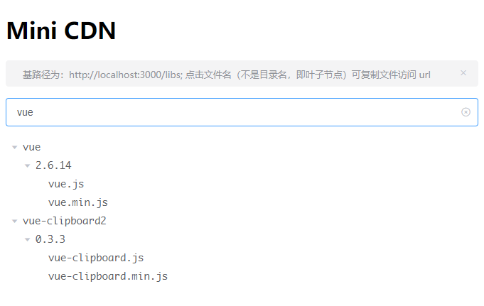

# mini-cdn

[](http://commitizen.github.io/cz-cli/)

## 这个是做什么的

类似于 [cdnjs](https://github.com/cdnjs/cdnjs)，
主要是为了方便本地开发或者公司/团队内部使用的公共库、插件、静态资源的管理。


## 使用方式

```bash
npm i
npm start
```

打开 [http://localhost:3000/](http://localhost:3000/) 即可





## 为什么做这个

方便本地开发或者小团队协作开发
